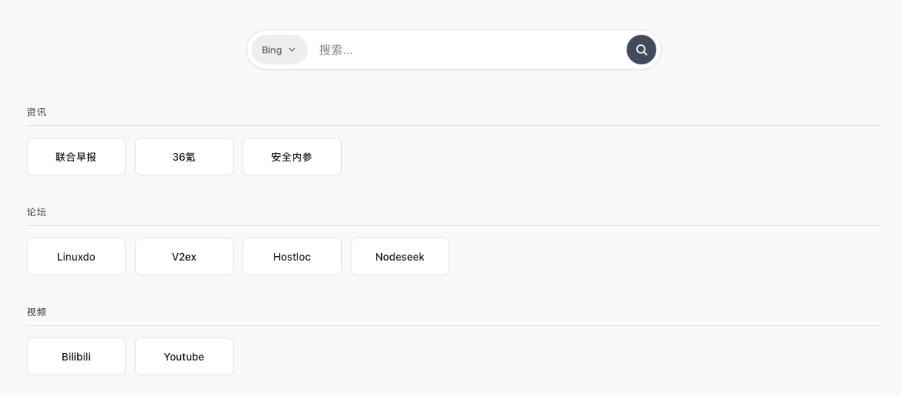

# Nav Sylph - 个人导航页

一个极简、高效的个人导航与书签管理页面，提供最纯粹的浏览起步体验。



## 功能特性

- **极简设计**：纯净无广告，秒开体验，专注搜索与书签
- **自定义搜索**：内置多个搜索引擎，支持在管理面板设置默认引擎
- **书签分类管理**：支持自定义分类名称及书签链接，拖拽排序
- **显示模式切换**：支持「图标+文字」和「纯文字」两种书签显示模式
- **管理面板**：点击右下角图标进入可视化编辑
- **PWA 支持**：可安装到桌面或手机主屏，像原生应用一样使用
- **响应式布局**：完美适配移动端和桌面端，支持系统级暗黑模式
- **安全防护**：Rate Limiting、安全头、bcrypt 密码加密
- **灵活配置**：支持环境变量、配置文件多种配置方式
- **HTTPS 支持**：可选启用 HTTPS，支持自定义证书路径

## 一键部署

### 🚀 服务器部署 (Linux)

```bash
# 一键安装
curl -fsSL https://raw.githubusercontent.com/mh567/nav-sylph/main/install.sh | bash

# 设置开机自启 (可选)
cd ~/nav-sylph
sudo ./manage.sh enable
```

### 💻 本地部署

#### Linux / macOS

```bash
# 一键安装
curl -fsSL https://raw.githubusercontent.com/mh567/nav-sylph/main/install.sh | bash
```

#### Windows

**方式一：使用 Git Bash 或 WSL**

```bash
curl -fsSL https://raw.githubusercontent.com/mh567/nav-sylph/main/install.sh | bash
```

**方式二：手动安装**

```powershell
# 1. 克隆仓库
git clone https://github.com/mh567/nav-sylph.git
cd nav-sylph

# 2. 安装依赖
npm install

# 3. 启动服务
npm start
```

### 📦 自定义安装目录

```bash
# 指定安装目录
NAV_SYLPH_DIR=/opt/nav-sylph curl -fsSL https://raw.githubusercontent.com/mh567/nav-sylph/main/install.sh | bash
```

### 🔄 更新与卸载

```bash
cd ~/nav-sylph

# 更新到最新版本
./install.sh update

# 卸载
./install.sh uninstall
```

## 默认密码

| 项目 | 值 |
|------|-----|
| **默认管理密码** | `admin123` |

> ⚠️ **安全提示**：首次登录后请立即在管理面板中修改密码！

服务器默认运行在 [http://127.0.0.1:4000](http://127.0.0.1:4000)。

## 传统方式部署

```bash
git clone https://github.com/mh567/nav-sylph.git
cd nav-sylph
npm install
npm start
```

## 管理脚本

| 命令 | 说明 |
|------|------|
| `./manage.sh install` | 初始化：安装依赖、创建目录、生成配置 |
| `./manage.sh start` | 启动服务（后台运行） |
| `./manage.sh stop` | 优雅停止服务 |
| `./manage.sh restart` | 重启服务 |
| `./manage.sh status` | 查看运行状态和健康检查 |
| `./manage.sh logs` | 查看实时日志 |
| `sudo ./manage.sh enable` | 安装 systemd 服务并启用开机自启 |
| `sudo ./manage.sh disable` | 卸载 systemd 服务 |

## 界面设置

在管理面板中可配置：

| 设置项 | 说明 |
|--------|------|
| **默认搜索引擎** | 设置页面加载时使用的搜索引擎 |
| **书签显示模式** | 「图标+文字」显示网站图标，「纯文字模式」仅显示标题 |

纯文字模式特别适合：
- 追求极简风格的用户
- 网络环境较差（减少图标请求）
- 移动端更大的触控区域

## 服务器配置

### 配置优先级

```
默认值 → server-config.json → .env 文件 → 环境变量
```

### 环境变量

复制 `.env.example` 为 `.env` 并编辑：

| 变量 | 默认值 | 说明 |
|------|--------|------|
| `SERVER_HOST` | `127.0.0.1` | 监听地址 |
| `SERVER_PORT` | `4000` | 监听端口 |
| `HTTPS_ENABLED` | `false` | 是否启用 HTTPS |
| `HTTPS_KEY_PATH` | - | SSL 私钥路径 |
| `HTTPS_CERT_PATH` | - | SSL 证书路径 |
| `HTTPS_CA_PATH` | - | CA 证书链路径（可选） |
| `ADMIN_PASSWORD_FILE` | `.admin-password.json` | 密码文件路径 |
| `LOG_DIR` | `logs` | 日志目录 |

### JSON 配置文件

创建 `server-config.json`：

```json
{
  "server": {
    "host": "127.0.0.1",
    "port": 4000,
    "https": {
      "enabled": false,
      "keyPath": "",
      "certPath": ""
    }
  }
}
```

## 安全特性

### 已实现的安全措施

| 特性 | 说明 |
|------|------|
| **密码加密** | bcrypt (cost=10) 哈希存储 |
| **密码强度** | 最低 8 位字符 |
| **Rate Limiting** | 认证接口限流（60秒内最多10次） |
| **安全头** | X-Content-Type-Options, X-Frame-Options, X-XSS-Protection, Referrer-Policy |
| **本地绑定** | 默认仅监听 127.0.0.1 |
| **XSS 防护** | 前端输出自动转义 |

### 生产部署安全清单

- [ ] 修改默认密码 `admin123`（**必须**）
- [ ] 配置 HTTPS 或使用反向代理
- [ ] 设置敏感文件权限：`chmod 600 .admin-password.json`
- [ ] 配置防火墙规则
- [ ] 定期更新依赖：`npm audit && npm update`

## API 接口

| 接口 | 方法 | 说明 |
|------|------|------|
| `/api/config` | GET | 获取书签配置 |
| `/api/config` | POST | 保存配置（需 `X-Admin-Password` 头） |
| `/api/verify-password` | POST | 验证管理密码 |
| `/api/change-password` | POST | 修改密码（body: `{newPassword}`） |
| `/api/health` | GET | 健康检查 |

**注意**：POST 接口受 Rate Limiting 保护。

## 书签配置

配置保存在 `config.json`：

| 字段 | 类型 | 说明 |
|------|------|------|
| `theme` | String | 主题：`light`、`dark`、`auto` |
| `searchEngine` | String | 默认搜索引擎 ID |
| `showBookmarkIcons` | Boolean | 是否显示书签图标 |
| `searchEngines` | Array | 搜索引擎列表 |
| `categories` | Array | 书签分类列表 |

## Systemd 服务

生产环境一键安装：

```bash
sudo ./manage.sh enable    # 安装并启用开机自启
sudo ./manage.sh disable   # 卸载服务
```

## 目录结构

```
nav-sylph/
├── public/                 # 前端静态文件
│   ├── index.html         # 主页面
│   ├── app.js             # 前端逻辑
│   ├── styles.css         # 样式
│   ├── sw.js              # Service Worker (PWA)
│   ├── manifest.json      # PWA 清单
│   ├── favicon.svg        # 网站图标
│   └── icon.svg           # 应用图标
├── server-config/          # 服务器配置模块
│   ├── defaults.js        # 默认配置
│   └── index.js           # 配置加载器
├── logs/                   # 日志目录
├── config.json            # 书签数据
├── server.js              # 后端服务
├── manage.sh              # 管理脚本
├── package.json           # 依赖配置
├── .env.example           # 环境变量示例
├── .gitignore             # Git 忽略规则
├── nav-sylph.service      # systemd 服务文件
├── DEPLOYMENT.md          # 部署指南
└── README.md              # 说明文档
```

## 技术栈

- **前端**：原生 JavaScript (ES6+), CSS3, HTML5
- **后端**：Node.js + Express.js
- **安全**：bcrypt 密码加密、Rate Limiting、安全头
- **存储**：JSON 文件存储

## 许可证

MIT License
